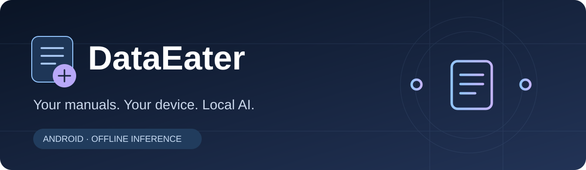
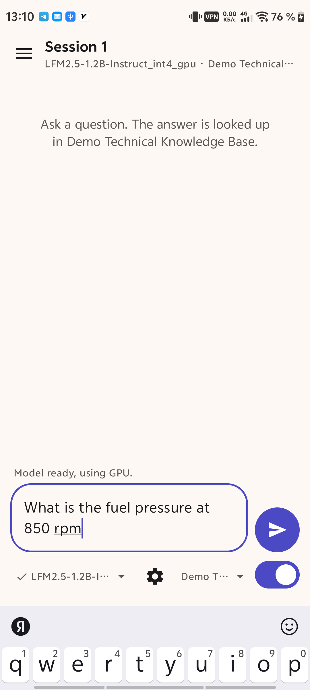
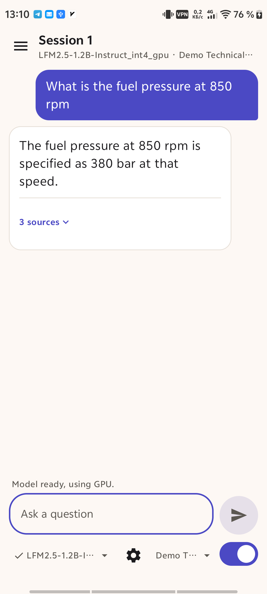
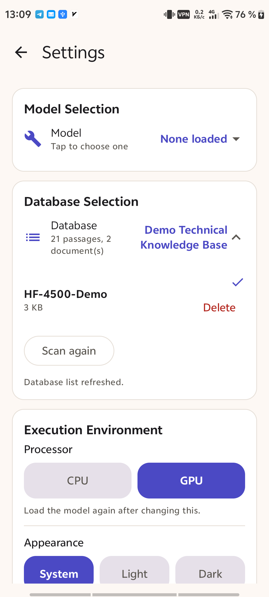

<p align="center">
  
</p>

<p align="center">
  <strong>Turn documents into specialized, offline AI knowledge.</strong><br>
  Ask questions. Get answers from your data. Trace them back to the source.
</p>

<p align="center">
  <a href="releases/README.md">Download & Installation</a> ·
  <a href="demo/example-workflow.md">Demo</a> ·
  <a href="docs/supported-devices.md">Supported Devices</a> ·
  <a href="CHANGELOG.md">Changelog</a>
</p>

**DataEater is a local AI knowledge engine for Android.** It lets you query specialized document databases using on-device AI, without sending your questions or document content to a cloud AI service.

Technical manuals are the first major use case, but DataEater is designed around a broader idea: **one application, many specialized knowledge databases.**

Potential database topics include equipment documentation, electronics references, scientific material, company documentation, books and other document knowledge. These are intended use cases; the public demonstration currently covers invented equipment information.


**Download the Android app:**

https://github.com/verum001/DataEater/releases/download/v1.1.0/DataEater-1.1.0.apk

**Download test database here:**

https://github.com/verum001/DataEater/releases/download/v1.1.0/FAA_Aviation_Maintenance_General_and_Powerplant_2023.dataeater

Install apk, start the program, grant permission. Place database in /sdcard/DataEater folder. Ask questions with the database turned on: 

“What can cause an aircraft engine to run rough at idle?”
“What are the possible causes of low oil pressure?”
“What should I check if an engine is overheating?”
“What can cause excessive oil consumption?”
“What are the symptoms of an overly rich fuel-air mixture?”
“What could cause low compression in a cylinder?”
“What should be inspected if a spark plug repeatedly fouls?”
“What are possible causes of abnormal engine vibration?”
“How can I identify an ignition-system problem?”
“What could cause an engine to hesitate during acceleration?”

## See it in action

| Ask | Answer | Choose a database |
|---|---|---|
|  |  |  |

[View an example with source references](screenshots/sources.png).

The screenshots are captured from the real Android application using a dedicated demonstration database with invented equipment information. No proprietary service manual, customer conversation, or private database is included.

## How it works

```text
              YOUR QUESTION
                    │
                    ▼
        ┌───────────────────────┐
        │       DATAEATER       │
        │                       │
        │  Knowledge Database   │
        │          +            │
        │    Local Retrieval    │
        │          +            │
        │      On-device AI     │
        └───────────┬───────────┘
                    │
                    ▼
             ANSWER + SOURCE
```

For example:

> **“What resistance should I measure across terminals X and Y?”**

DataEater searches the selected knowledge database for relevant information and provides that information to the local AI model to construct an answer.

When source metadata is available, the answer can point back to the relevant **document, section and page**.

If DataEater cannot find relevant information in the selected database, it is designed to say so rather than invent a database source.

## Why DataEater?

DataEater brings document questions and local AI together on your Android device:

**Your database. Your device. Your AI.**

- **Offline AI** — inference runs directly on the Android device.
- **Local knowledge** — query imported databases without uploading their contents to an AI service.
- **Source-aware answers** — answers can reference the documents and sections used.
- **Specialized databases** — switch between different knowledge domains instead of tying the application to one manual or industry.
- **No account required** — the application does not depend on a DataEater cloud account.
- **Portable knowledge** — the long-term architecture is designed around independently created DataEater databases.

## What works today

DataEater is a working Android application, not a UI concept or mock-up.

Current functionality includes:

- Local Android AI chat.
- Questions against imported document databases.
- Document, section and page references when available.
- Explicit switching between database-backed questions and general model chat.
- Optional AI model downloads with progress, cancellation and file verification.
- Local model and database management.
- Remembered conversations and Android text selection.
- Encrypted databases with creator-issued, device-bound access codes.
- Responsive layouts for different screen and text sizes.
- A sliding conversation panel and Help.

Online database downloads are planned and are not available in this preview.

## One engine, different knowledge

DataEater is not intended to be tied to one type of documentation.

```text
Machinery manuals ───────┐
Electronics references ──┤
Scientific literature ───┤
Company documentation ───┼──► DataEater ──► Local AI answers
Books & reference works ──┤
Personal knowledge ───────┤
Specialized datasets ─────┘
```

The knowledge changes.

**DataEater stays the same.**

## Privacy

AI inference, document retrieval and access-code verification run locally on the device.

Questions and document text are not sent to a cloud AI service.

There is:

- no DataEater account;
- no telemetry service;
- no analytics service;
- no cloud AI dependency.

The application can access the internet to download optional AI models from Hugging Face. Questions and database content are not included in those model-download requests.

Private application data is excluded from Android system backup and device migration.

This describes DataEater's application architecture and should not be interpreted as an operating-system guarantee that an installed APK is technically incapable of networking.

AI models remain subject to their respective publishers' licenses and terms.

## Database ownership

DataEater databases are independent from the application itself.

A database creator may distribute public knowledge, private organizational knowledge, licensed material, or other content they have the right to use.

DataEater also supports encrypted databases with creator-controlled access.

Rights in the original documents, derived databases, AI models and DataEater application are separate.

**Only import, create or distribute databases from material you have the right to use.**

## Important limitations

DataEater can make mistakes.

A local language model may misunderstand retrieved information, omit important context or produce an incorrect answer even when relevant database information was found.

For technical, safety-critical or professional work, **verify the cited source before acting on an answer**.

General chat is based on the selected model's own knowledge and is not verified against a DataEater database.

DataEater does not replace manufacturer documentation, official procedures, professional training or qualified judgment.

## Project status

**Current public preview: v1.1.0 — October 2026**

DataEater is under active development. This repository is the official public project page for the current DataEater preview.

[PROVENANCE.md](PROVENANCE.md) records public artifact hashes and the scope of the published release. The original development history is retained privately because earlier commits contain implementation details that are not part of this public repository.

## Source availability

This repository currently serves as the public home of the DataEater project, including documentation, demonstrations, screenshots and release artifacts.

**The core implementation is not currently published.**

Database construction, retrieval and ranking code, prompts, preprocessing pipelines and internal optimizations remain private. Components may be released separately in the future, but no future source release is promised.

## License & ownership

Copyright © 2026 **Jack**.

DataEater original software, the released APK and original public documentation are licensed under the [Apache License 2.0](LICENSE), which permits reuse, modification and redistribution under its terms. See [NOTICE](NOTICE) for attribution. The implementation source remains unpublished.

Third-party software, AI models and other dependencies remain subject to their respective licenses. See [THIRD_PARTY_NOTICES.md](THIRD_PARTY_NOTICES.md).

Rights in documents and databases used with DataEater are separate from rights in the DataEater application.

---

<p align="center">
  <strong>DATAEATER</strong><br>
  Your data. Your device. Your AI.
</p>
