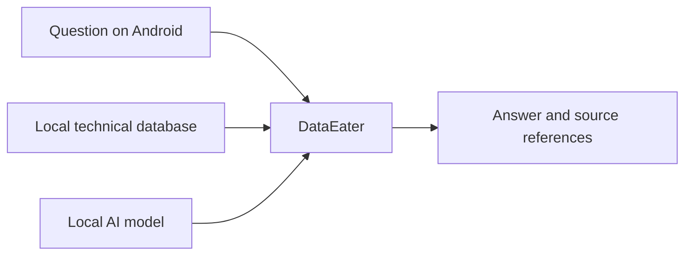

# Architecture overview

DataEater is an Android application with three visible responsibilities:

1. Manage local conversations, models and imported document databases.
2. Consult the selected database when document-backed answers are requested.
3. Run a compatible language model locally and present an answer with available source references.

Model downloads are an optional network operation. Chat inference and document lookup use local files. Encrypted databases can require creator-issued access codes bound to a device.

This is a product-level overview. The implementation, file-format internals, database construction, retrieval/ranking, prompts and optimization details remain private. An APK necessarily contains executable implementation and can be inspected; unpublished source is not a guarantee against reverse engineering.
